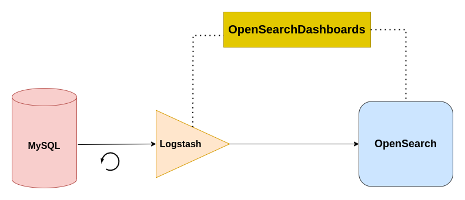

# sync-opensearch-mysql
Using Logstash to synchronize an OpenSearch index with MySQL data

## Introduction

This project is a working example demonstrating how to use Logstash to link OpenSearch to a MySQL database in order to:
- Build an OpenSearch index from scratch
- Continuously monitor changes on the database records and replicate any of those changes to OpenSearch (`create`, `update`, `delete`)

It uses:
- MySQL as the main database of a given business architecture (version 8.0)
- OpenSearch as a text search engine (version latest)
- Logstash-oss-with-OpenSearch-output-plugin as a connector or data pipe from MySQL to OpenSearch (version latest)
- OpenSearch Dashboards for monitoring, data visualization, and debugging tool (version latest)



This repo is a valid prototype and works as it is, however it is not suitable for a production environment. Please refer to the official documentation of each of the above technologies for instructions on how to go live in your production environment.

## Deployment
On your development/local environment, run the following commands on a terminal:

> Note: Make sure to install [Docker](https://docs.docker.com/get-docker/) and [Docker Compose](https://docs.docker.com/compose/install/)

```bash
# Clone this project and cd into it
git clone https://github.com/sadi01/sync-opensearch-mysql.git && cd sync-opensearch-mysql

# Start the whole architecture
docker-compose up # add -d for detached mode

# To keep an eye on the logs
docker-compose logs -f --tail 111 <service-name>
```

To start services separately or in a different order, you can run:
```bash
docker-compose up -d mysql
docker-compose up -d opensearch opensearch-dashboards
docker-compose up logstash
```

## Testing
Please refer to the above article for testing steps.

## Resources
- [How to synchronize Elasticsearch with MySQL](https://towardsdatascience.com/how-to-synchronize-elasticsearch-with-mysql-ed32fc57b339)
- Inspiration by [How to keep elasticsearch synchronized with a relational database using Logstash and JDBC](https://www.elastic.co/blog/how-to-keep-elasticsearch-synchronized-with-a-relational-database-using-logstash). However the article does not deal with indexing from scratch and deleted records.
- Data used for this project is available in the Kaggle dataset [Goodreads-books](https://www.kaggle.com/jealousleopard/goodreadsbooks)
- [Logstash JDBC input plugin](https://www.elastic.co/guide/en/logstash/current/plugins-inputs-jdbc.html)
- [Logstash Mutate filter plugin](https://www.elastic.co/guide/en/logstash/current/plugins-filters-mutate.html)
- [Logstash OpenSearch output plugin](https://opensearch.org/docs/latest/clients/logstash/index)
